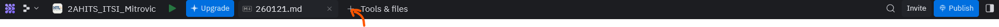
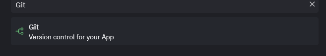
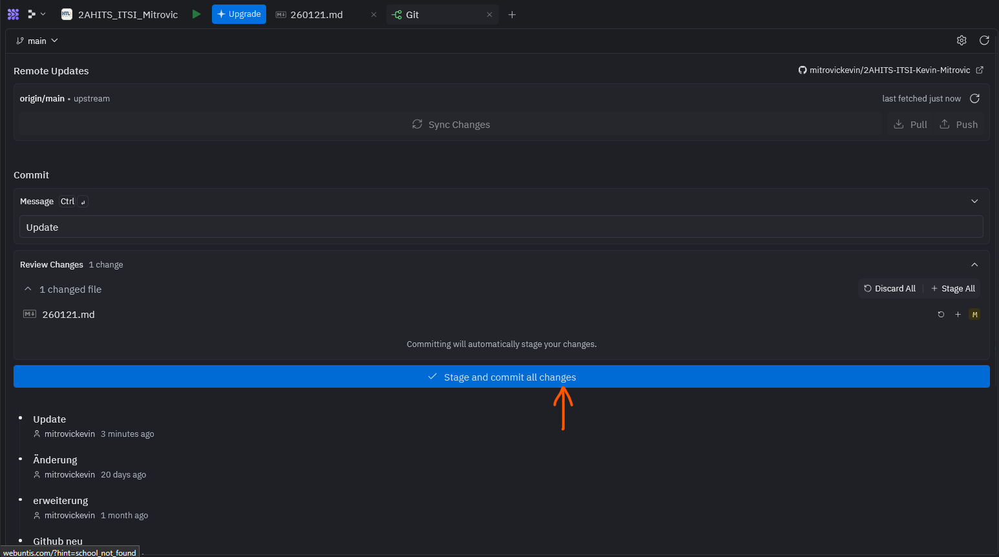
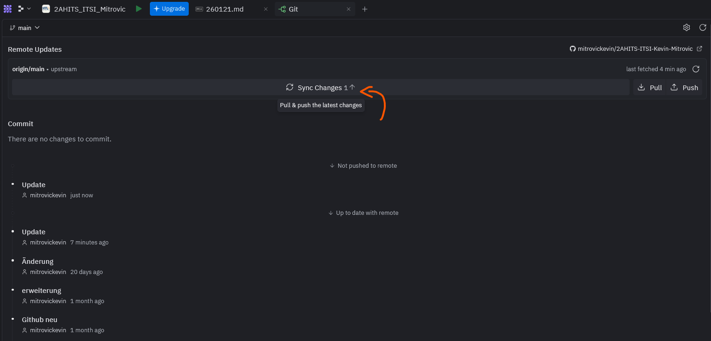
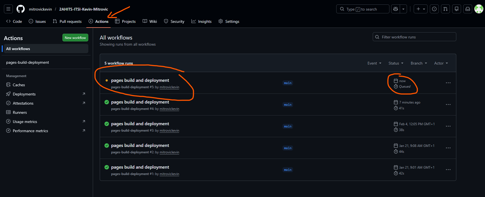
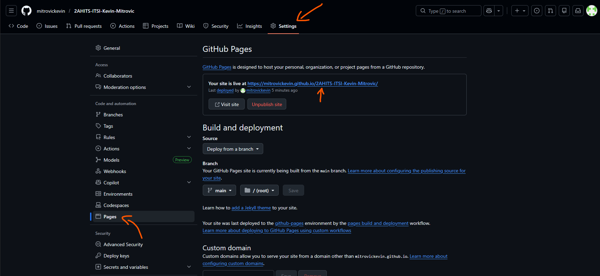
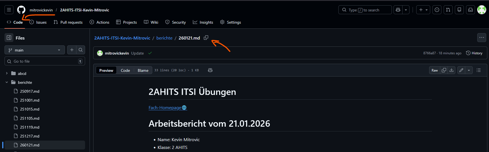
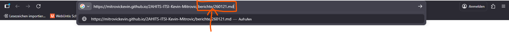

[Fach-Homepage🌐](https://www.franzmatejka.at/htl/doc/_SJ_2025/2AHITS_ITSI.html)

# Arbeitsbericht vom 21.01.2026

- Name: Kevin Mitrovic
- Klasse: 2 AHITS
- Gruppe: 2
- Fach: ITSI Übungen
- Thema: Replit & GitHub Pages

---

## 1. Schritt

- Sobald du eine Änderung an deinem Bericht durchführst, muss diese **"hochgeladen"** werden.

- **Git öffnen:** Klicke in Replit auf das **+** und suche nach **Git**
- 
- 

- **Commit erstellen:** Gib im Feld **"Summary"** eine kurze Nachricht ein (z. B. "Update" oder "Change"), damit du später weißt, was geändert wurde.
- 

- **Bestätigen:** Klicke auf den blauen Button **"Stage and commit all changes"**.
- 

- **Synchronisieren:** Drücke danach oben auf **"Sync Changes"**, um die Daten an GitHub zu senden.
- 

- **Kontrolle:** Du kannst auf GitHub unter dem Reiter **"Actions"** live mitverfolgen, ob der Prozess (Build) erfolgreich durchläuft. Ein grüner Haken bedeutet, die Seite ist **bereit**. Wenn **kein** grüner Hacken dann ist es noch in **Bearbeitung**!
- 

---

## 2. Schritt

Bevor du den Link zu einem speziellen Bericht hast, benötigst du die Adresse deiner Hauptseite.

- Gehe auf **GitHub** in dein **Repository** und klicke auf **Settings** (Zahnrad).

- Wähle links den Punkt **Pages** aus.

- Dort siehst du unter **"Your site is live at..."** deinen persönlichen **Basis-Link**. **Kopiere** diesen in einen **neuen Tab**.
- 
- 

---

## 3. Schritt

Da dein Repository viele Dateien enthalten kann, musst du GitHub sagen, welche Datei genau angezeigt werden soll.

- **Pfad kopieren:** Gehe in GitHub zum Reiter **Code** und navigiere zu der Datei, die du abgeben möchtest und **kopiere den Pfad**(z. B. im Ordner Berichte).
- 

- **URL zusammensetzen:** Füge den Pfad der Datei hinter deinen **Basis-Link (Kopierter Link im neuen Tab)** aus **Schritt 2** an.
- 

- **Markdown zu HTML:** Wenn deine Datei auf GitHub .md (Markdown) heißt, musst du sie in der Adresszeile am Ende manuell in .html umbenennen,    
damit sie korrekt als Webseite angezeigt wird.

- **Beispiel:** Aus **.../Berichte/260223.md** wird in der Adresszeile **.../Berichte/260223.html**.
- 