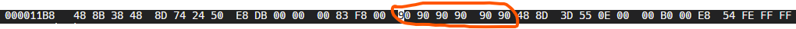
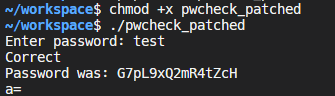

# 2AHITS ITSI Übungen

[Fach-Homepage🌐](https://www.franzmatejka.at/htl/doc/_SJ_2025/2AHITS_ITSI.html)


# Arbeitsbericht vom 26.05.2026

- Name: Kevin Mitrovic
- Klasse: 2 AHITS
- Gruppe: 2
- Fach: ITSI Übungen
- Thema: Binary File Patching I

---

## Wichtig

- Ich kam erst in der 2. Stunde zum Unterricht dementsprechend ist sich nicht viel ausgegangen. Danke für Ihr Verständnis!


<br>
<br>


## Übung (Binary File Patching I)

Die Änderungen lassen sich auch permanent im Binärfile des Programms durchführen. Dazu analysiert man mit `objdump -d pwcheck` die Programmdatei, um herauszufinden, auf welchem Offset sich die zu manipulierenden Daten befinden.

Suche in der Ausgabe nach `main`:

```assembly
0000000000001170 <main>:
    1170:       48 81 ec 98 00 00 00    sub    $0x98,%rsp
    1177:       64 48 8b 04 25 28 00    mov    %fs:0x28,%rax
    117e:       00 00 
    1180:       48 89 84 24 90 00 00    mov    %rax,0x90(%rsp)
    1187:       00 
    1188:       c7 44 24 04 00 00 00    movl   $0x0,0x4(%rsp)
    118f:       00 
    1190:       48 8d 3d 7d 0e 00 00    lea    0xe7d(%rip),%rdi        # 2014 <_IO_stdin_used+0x14>
    1197:       b0 00                   mov    $0x0,%al
    1199:       e8 92 fe ff ff          call   1030 <printf@plt>
    119e:       48 8d 74 24 50          lea    0x50(%rsp),%rsi
    11a3:       48 8d 3d 7b 0e 00 00    lea    0xe7b(%rip),%rdi        # 2025 <_IO_stdin_used+0x25>
    11aa:       b0 00                   mov    $0x0,%al
    11ac:       e8 af fe ff ff          call   1060 <__isoc23_scanf@plt>
    11b1:       48 8d 05 58 2e 00 00    lea    0x2e58(%rip),%rax        # 4010 <expected>
    11b8:       48 8b 38                mov    (%rax),%rdi
    11bb:       48 8d 74 24 50          lea    0x50(%rsp),%rsi
    11c0:       e8 db 00 00 00          call   12a0 <_Z14check_passwordPKcS0_>
    11c5:       83 f8 00                cmp    $0x0,%eax
    11c8:       0f 84 95 00 00 00       je     1263 <main+0xf3>
    11ce:       48 8d 3d 55 0e 00 00    lea    0xe55(%rip),%rdi        # 202a <_IO_stdin_used+0x2a>
    11d5:       b0 00                   mov    $0x0,%al
    11d7:       e8 54 fe ff ff          call   1030 <printf@plt>
    11dc:       48 8d 05 2d 2e 00 00    lea    0x2e2d(%rip),%rax        # 4010 <expected>
    11e3:       48 8b 38                mov    (%rax),%rdi
    11e6:       48 8d 74 24 10          lea    0x10(%rsp),%rsi
    11eb:       e8 80 01 00 00          call   1370 <_Z12rot13_stringPKcPc>
    11f0:       48 8d 74 24 10          lea    0x10(%rsp),%rsi
    11f5:       48 8d 3d 37 0e 00 00    lea    0xe37(%rip),%rdi        # 2033 <_IO_stdin_used+0x33>
    11fc:       b0 00                   mov    $0x0,%al
    11fe:       e8 2d fe ff ff          call   1030 <printf@plt>
    1203:       48 8d 3d 3b 0e 00 00    lea    0xe3b(%rip),%rdi        # 2045 <_IO_stdin_used+0x45>
    120a:       b0 00                   mov    $0x0,%al
    120c:       e8 1f fe ff ff          call   1030 <printf@plt>
    1211:       48 8d 3d 30 0e 00 00    lea    0xe30(%rip),%rdi        # 2048 <_IO_stdin_used+0x48>
    1218:       48 8d 74 24 0c          lea    0xc(%rsp),%rsi
    121d:       b0 00                   mov    $0x0,%al

```

Hier ist die zu manipulierende Stelle:

    11c8:       0f 84 95 00 00 00       je     1263 <main+0xf3>

Dabei ist 11c8 der hexadezimale Offset vom Beginn der Datei. An dieser Stelle steht der Maschinensprachebefehl je. Conditional Jump if Equal. Wir überschreiben diesen 6 Byte langen Befehl mit nop’s. Ein nop (no operation) ist ein 1 Byte großer Befehl (0x90). Achtung: je kann unterschiedliche Längen haben, je nach dem wie weit das Sprungziel weg ist – hier sind es 6 Bytes.

Diese Manipulation von Daten nennt man “patchen” (engl. “to patch”).

Fürs patchen das Tool hexeditor verwenden:

hexedit pwcheck

Ctrl+G (goto)
Offset in Hex eingeben
Bytes überschreiben mit 90
Ctrl+X (save and exit)
und testen.

Was ist das Passwort?

---

## Lösung

### - Schritt 1: Das Programm im Hex-Editor öffnen

```
hexedit pwcheck
```

<br>

### - Schritt 2: Zur richtigen Adresse springen

**Wir müssen exakt zur Adresse 11c8 navigieren.**

- Drücke die Tastenkombination Strg + G.

- Tippe dort ein: 11c8
 


- Drücke Enter

<br>

### Schritt 3: Die 6 Bytes mit NOPs überschreiben

**Der Cursor steht auf dem ersten Byte des je-Befehls. Wir müssen jetzt die 6 Bytes 0F 84 95 00 00 00 mit 90 überschreiben.**



<br>

### Schritt 4: Speichern und Beenden

- Drücke Strg + X (oder Ctrl + X).

- Der Editor fragt dich, ob du die Änderungen speichern möchtest.

- Drücke Y (für Yes) bzw. J (für Ja, je nach Sprache) und bestätige gegebenenfalls mit Enter.

<br>

### Schritt 5: Das manipulierte Programm starten

**Jetzt führen wir das Programm aus. Da wir den Sperr-Befehl gelöscht haben, wird das Programm nun bei jeder Eingabe so tun, als wäre das Passwort korrekt.**

- Mach die Datei zur Sicherheit nochmal ausführbar:


  ```chmod +x pwcheck```

- Starte das Programm:


  ```./pwcheck```


    **Das Programm fordert dich auf, ein Passwort einzugeben. Tippe ein völlig beliebiges Wort ein (z. B. test) und drücke Enter.**

  <br>

### Das Passwort ist: G7pL9xQ2mR4tZcH

<br>



- **Die File heißt bei mir `pwcheck_patched`, weil ich ein Problem beim ausführen mit der `pwcheck File` hatte. Die Lösung war einfach die `pwcheck` File in eine andere File zu kopieren. In dem Fall `pwcheck_patched`!**